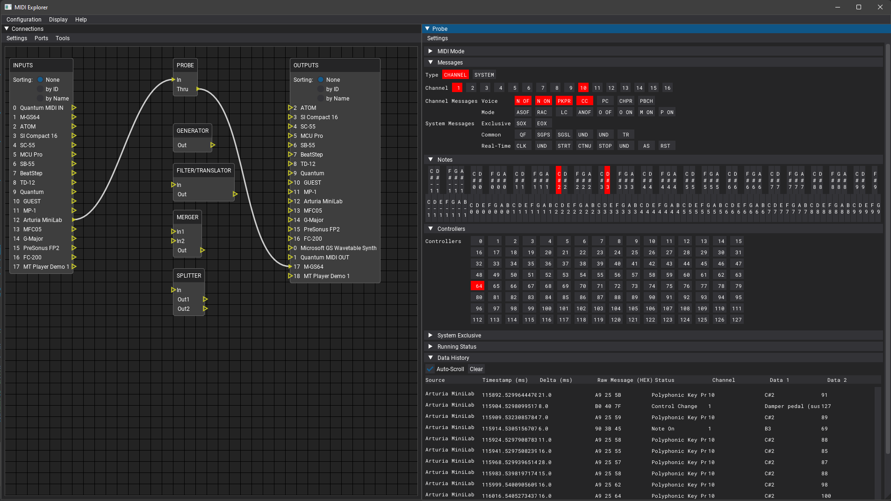

 MIDI Explorer
===========================================================

Yet another MIDI monitor, analyzer, debugger and manipulation tool.

The intent is to be [specifications](https://www.midi.org/specifications) compliant to help debugging,
reverse-engineering and developing products based on the MIDI protocol while learning everything there is to know in the
process.

Language is currently Python to help with rapid prototyping and fast iteration. It may change at any time as I see fit.

Status
------

Basic features implemented.
Testers welcome ;)

Alpha coming soon!

Features / TODO list
--------------------

- [ ] Platform support
  - [ ] **(WIP)** Microsoft Windows
    - [x] WinMM aka [Windows Multimedia MME API](https://docs.microsoft.com/fr-fr/windows/win32/api/mmeapi/)
      - via mido's RtMidi backend
    - [ ] WinRt aka [UWP Windows Runtime API](https://docs.microsoft.com/en-us/uwp/api/windows.devices.midi)
      - [RtMidi related  issue](https://github.com/thestk/rtmidi/issues/145)
  - [ ] **(WIP)** Apple Mac OS X
    - [x] Core MIDI
      - via mido's RtMidi backend
    - [ ] [JACK MIDI](https://jackaudio.org/api/group__MIDIAPI.html) (Should work but untested ATM)
  - [ ] **(WIP)** GNU/Linux
    - [ ] **(WIP)** ALSA
      - [x] [Sequencer API](https://www.alsa-project.org/alsa-doc/alsa-lib/seq.html)
        - via mido's RtMidi backend
      - [ ] [RawMidi API](https://www.alsa-project.org/alsa-doc/alsa-lib/rawmidi.html)
      - [ ] [JACK MIDI](https://jackaudio.org/api/group__MIDIAPI.html) (Should work but untested ATM)
    - [ ] OSS?
- [ ] Documentation
  - [ ] Developers
    - [X] Comments
    - [ ] **(WIP)** Docstrings ([PEP257](https://peps.python.org/pep-0257))
    - [ ] **(WIP)** Type Hinting ([PEP484](https://peps.python.org/pep-0484))
  - [ ] Users
    - [ ] [Sphinx](https://www.sphinx-doc.org)
      - [ ] [autodoc](https://www.sphinx-doc.org/en/master/usage/extensions/autodoc.html)
      - [ ] [Read The Docs](https://readthedocs.org)
- [ ] Linting
  - [ ] Code style checks? ([PEP8](https://peps.python.org/pep-0008) pycodestyle)
  - [ ] Docstrings? (darglint)
  - [ ] Typechecking? (mypy)
- [ ] Unit tests? (pytest)
  - [ ] Coverage
- [ ] [Packaging](https://packaging.python.org)
  - [ ] [PyPi](https://pypi.org)
  - [ ] [PyInstaller](https://pyinstaller.org)
- [ ] Continuous Integration? (GitHub Actions workflow)
- [ ] **(WIP)** MIDI protocols
  - [x] v1.0
    - using a [modified mido](https://github.com/mido/mido/pull/370)
  - [ ] v2.0
- [ ] **(WIP)** Interactive GUI
  - [x] Icons
  - [x] About window
  - [x] Fonts
  - [ ] Custom theme
  - [X] Node editor window
    - [X] Inputs
    - [X] Outputs
    - [x] Modules
  - [x] Probe data window
  - [ ] Generator data window
  - [x] Log window
  - [ ] **(WIP)** Actions
    - [x] Toggle fullscreen (F11)
    - [x] Toggle log (F12)
    - [ ] Save state (Buggy at the moment)
- [ ] **(WIP)** I/O management
  - [ ] Select backend?
  - [ ] **(WIP)** List MIDI I/O
    - [x] USB / IEEE-1394 (OS level)
    - [ ] Bluetooth Low Energy (BLE-MIDI)
      - Requires WinRt for Microsoft Windows
    - [ ] RTP-MIDI / IETF RFC 6295
    - [ ] Virtual
  - [x] Input reading modes
    - [x] Polling
    - [x] Callback
  - [ ] Sort by ID/Name
  - [ ] **(WIP)** Connections
    - [x] Port to probe
    - [x] Probe to port
    - [x] Port to port
    - [ ] Port to any module
    - [ ] Any module to port
    - [ ] Module to module
  - [ ] **(WIP)** Refresh
    - [X] Manual
    - [ ] Auto with reconnect
  - [ ] Virtual ports
    - [ ] Add/Remove
  - [ ] Save state
- [ ] **(WIP)** Modules (Plugins?)
  - [ ] Instances management (Add/Remove)
  - [x] Virtual Debug Probe
    - [x] Activity monitor
      - [x] Settings
        - [x] Persistence
        - [x] Note-On with velocity set to 0 is Note-Off (Per specification)
      - [x] Message type
        - [x] Channel
        - [x] System
      - [x] Channel
      - [x] Controllers
      - [ ] **(WIP)** SysEx
        - [x] Basic decoding
        - [ ] Sample dump standard
        - [ ] Device inquiry
        - [ ] File dump
        - [ ] MIDI tuning
        - [ ] General MIDI system messages
        - [ ] MIDI Time Code (MTC)
        - [ ] MIDI Show Control (MSC)
        - [ ] Notation information
        - [ ] Device Control
        - [ ] MIDI Machine Control (MMC)
      - [ ] **(WIP)** Notes
        - [x] Keyboard
        - [ ] Staff
    - [x] Read raw input
    - [x] Table decode input
    - [x] Timing
      - [x] Hardware
        - retrieved using a modified mido RtMidi backend
      - [x] System
    - [x] Thru support
    - [ ] Color code
      - [ ] Per source
      - [ ] Per channel
      - [ ] Per message type
  - [ ] Splitter
  - [ ] Merger
  - [ ] Generator
    - [ ] Generate raw output
    - [ ] Buffer/Clipboard any message (raw or decoded) to output
  - [ ] Translator/Filter
  - [ ] Standard MIDI File (SMF)
    - [ ] Analyzer
    - [ ] Player
    - [ ] Recorder
  - [ ] Protocol analyzers/decoders
    - [ ] HUI
    - [ ] LCU
    - [ ] MCU
    - Others?
  - [ ] Trigger/Response (Protocol emulator)
    - [ ] HUI
    - [ ] LCU
    - [ ] MCU
    - Others?
  - [ ] Performance analyzer
    - [ ] Round trip latency
    - [ ] Jitter
    - [ ] Bandwidth
    - [ ] Correctness
    - [ ] Stresser/Fuzzer
  - [ ] Hardware toolbox
- [ ] **(WIP)** Logging
  - [x] GUI
  - [ ] To file
    - [ ] Overwrite
    - [ ] Append

Prior art
---------

- [MIDI-OX](http://www.midiox.com/) (Win)
- [Snoize MIDI Monitor](https://www.snoize.com/midimonitor/) (Mac)
- [Midi View](https://hautetechnique.com/midi/midiview/) (Win/Mac)
- [OBD Software Midi Monitor 2002](http://obds.free.fr/midimon/) (Win)
- [Morson PocketMIDI](https://www.morson.jp/pocketmidi-webpage/) (Win/Mac/iOS)
- [Drumstick MIDI Monitor aka KMidiMon](https://kmidimon.sourceforge.io) (Linux)

Legal notice
------------

### License

Author: ©2021-2022 Raphaël Doursenaud.

This software is released under the terms of the GNU General Public License, version 3.0 or later (GPL-3.0-or-later).

See [LICENSE](LICENSE).

Logo and icons released under the
[Creative Commons Attribution-Share Alike 4.0 International](https://creativecommons.org/licenses/by-sa/4.0/).

### Dependencies & License Acknowledgment

- [Python](https://python.org) v3.10  
  Used under the terms of the PSF License Agreement.
- [RtMidi](https://github.com/thestk/rtmidi)  
  Copyright (c) 2003-2021 Gary P. Scavone  
  Used under the terms of the MIT License.
- via [python-rtmidi](https://github.com/SpotlightKid/python-rtmidi)  
  Copyright (c) 2012 - 2021 Christopher Arndt  
  Used under the terms of the MIT License.
- via [mido](https://github.com/mido/mido)  
  Copyright (c) 2013-infinity Ole Martin Bjørndalen    
  Used under the terms of the MIT License.
- [Dear ImGui](https://github.com/ocornut/imgui)  
  Copyright (c) 2014-2022 Omar Cornut  
  Used under the terms of the MIT License.
- via [Dear PyGui](https://github.com/hoffstadt/DearPyGui)  
  Copyright (c) 2021 Dear PyGui, LLC  
  Used under the terms of the MIT License.

#### Fonts

- [Roboto](https://github.com/googlefonts/Roboto)  
  Copyright (c) 2015 The Roboto Project Authors  
  Used under the terms of the Apache License, Version 2.0.
- [Roboto Mono](https://github.com/googlefonts/RobotoMono)  
  Copyright (c) 2015 The Roboto Mono Project Authors  
  Used under the terms of the Apache License, Version 2.0.

#### Logo and icons

Composite work based upon:

- [MIDI connector](https://commons.wikimedia.org/wiki/File:MIDI_connector2.svg)  
  Copyright [Fred the Oyster](https://commons.wikimedia.org/wiki/User:Fred_the_Oyster)  
  Used under the terms of the
  [Creative Commons Attribution-Share Alike 4.0 International](https://creativecommons.org/licenses/by-sa/4.0/) license.
- [Steering Wheel](https://commons.wikimedia.org/wiki/File:Steering_Wheel_Black.svg)  
  Copyright [Spider](https://commons.wikimedia.org/wiki/User:Spider)  
  Used under the terms of the
  [Creative Commons Attribution 4.0 International](https://creativecommons.org/licenses/by/4.0/) license.

### Trademarks

[MIDI](https://midi.org) is a trademark of the MIDI Manufacturers Association (MMA) in the United States of America.

This is not a registered trademark in the European Union and France where I reside.

#### Other

Other trademarks are property of their respective owners and used fairly for descriptive and nominative purposes only.
