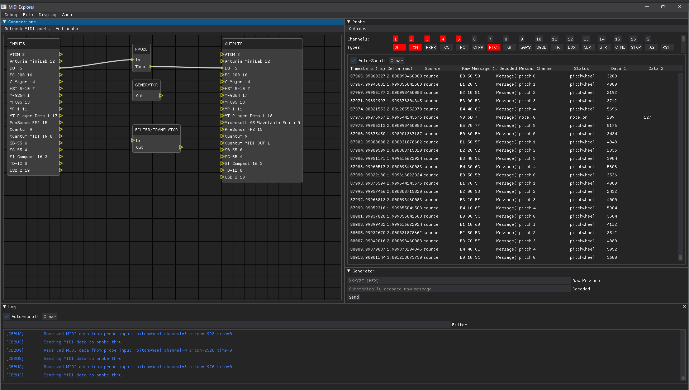

MIDI Explorer
=============

Yet another MIDI monitoring, debugging and manipulating tool.

The intent is to be [specifications](https://www.midi.org/specifications) compliant to help debugging,
reverse-engineering and developing products based on the MIDI protocol while learning everything there is to know in the
process.

Language is currently Python to help with rapid prototyping and fast iteration. It may change at any time as I see fit.

Status
------

Proof of concept!

Currently, in the prototyping phase.

Features / TODO list
--------------------

- [ ] Platform support
  - [ ] **(WIP)** Microsoft Windows
    - [x] WinMM aka [Windows Multimedia MME API](https://docs.microsoft.com/fr-fr/windows/win32/api/mmeapi/)
      - via mido's RtMidi backend
    - [ ] WinRt aka [UWP Windows Runtime API](https://docs.microsoft.com/en-us/uwp/api/windows.devices.midi)
      - [RtMidi related  issue](https://github.com/thestk/rtmidi/issues/145)
  - [ ] Apple Mac OS X
  - [ ] GNU/Linux
- [ ] MIDI protocol
  - [x] v1.0
    - using mido
  - [ ] v2.0
- [ ] **(WIP)** Interactive GUI
  - [ ] Icons
  - [ ] About window
  - [X] Node editor window
    - [X] Inputs
    - [X] Outputs
    - [x] Modules
  - [x] Probe data window
  - [ ] **(WIP)** Generator data window
  - [x] Log window
  - [ ] Actions
    - [x] Toggle fullscreen (F11)
    - [x] Toggle log (F12)
    - [ ] **(WIP)** Save state (Buggy at the moment)
- [ ] I/O management
  - [ ] Select backend?
  - [ ] List MIDI I/O
    - [x] USB / IEEE-1394 (OS level)
    - [ ] Bluetooth Low Energy (BLE-MIDI)
      - Requires WinRt for Microsoft Windows
    - [ ] RTP-MIDI / IETF RFC 6295
    - [ ] Virtual
  - [ ] Sort by ID/Name
  - [X] Effective connections
  - [ ] Refresh
    - [X] Manual
    - [ ] Auto with reconnect
  - [ ] Virtual ports
    - [ ] Add/Remove
  - [ ] Save state
- [ ] Modules (Plugins?)
  - [ ] Instances management (Add/Remove)
  - [x] Virtual Debug Probe
    - [x] Activity monitor
      - [x] Settings
        - [x] Persistence
        - [x] Note-On with velocity set to 0 is Note-Off (Per specification)
      - [x] Channels & System
      - [x] Message type
      - [x] Timing
        - [ ] System
        - [x] Hardware
          - retrieved using a modified mido RtMidi backend
    - [x] Read raw input
    - [x] Table decode input
    - [x] Thru support
  - [ ] Splitter
  - [ ] Merger
  - [ ] Generator
    - [ ] Generate raw output
    - [ ] Buffer/Clipboard any message (raw or decoded) to output
  - [ ] Translator/Filter
  - [ ] Standard MIDI File (SMF)
    - [ ] Analyzer
    - [ ] Player
    - [ ] Recorder
  - [ ] Protocol analyzers/decoders
    - [ ] HUI
    - [ ] LCU
    - [ ] MCU
  - [ ] Trigger/Response (Protocol emulator)
    - [ ] HUI
    - [ ] LCU
    - [ ] MCU
  - [ ] Hardware toolbox
- [ ] **(WIP)** Logging
  - [x] GUI
  - [ ] To file
    - [ ] Overwrite
    - [ ] Append

Legal notice
------------

### License

Copyright 2022 Raphaël Doursenaud.

This software is released under the terms of the GNU General Public License, version 3.0 or later (GPL-3.0-or-later).

See [LICENSE](LICENSE).

### Dependencies & License Acknowledgment

- [Python](https://python.org) v3.10  
  Used under the terms of the PSF License Agreement.
- [RtMidi](https://github.com/thestk/rtmidi)  
  Copyright (c) 2003-2021 Gary P. Scavone  
  Used under the terms of the MIT License.
- via [python-rtmidi](https://github.com/SpotlightKid/python-rtmidi)  
  Copyright (c) 2012 - 2021 Christopher Arndt  
  Used under the terms of the MIT License.
- via [mido](https://github.com/mido/mido)  
  Copyright (c) 2013-infinity Ole Martin Bjørndalen    
  Used under the terms of the MIT License.
- [Dear ImGui](https://github.com/ocornut/imgui)  
  Copyright (c) 2014-2022 Omar Cornut  
  Used under the terms of the MIT License.
- via [Dear PyGui](https://github.com/hoffstadt/DearPyGui)  
  Copyright (c) 2021 Dear PyGui, LLC  
  Used under the terms of the MIT License.

### Trademarks

[MIDI](https://midi.org) is a trademark of the MIDI Manufacturers Association (MMA) in the United States of America.

This is not a registered trademark in the European Union and France where I reside.

#### Other

Other trademarks are property of their respective owners and used fairly for descriptive and nominative purposes only.
